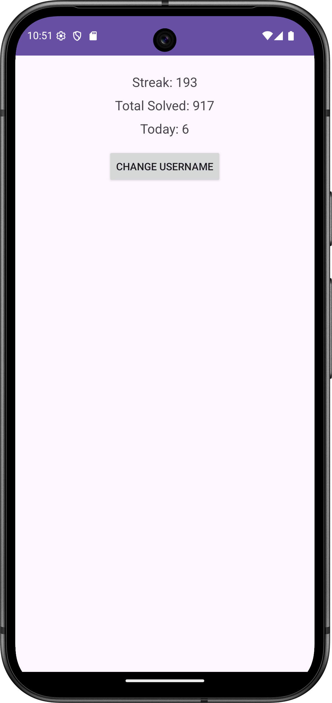
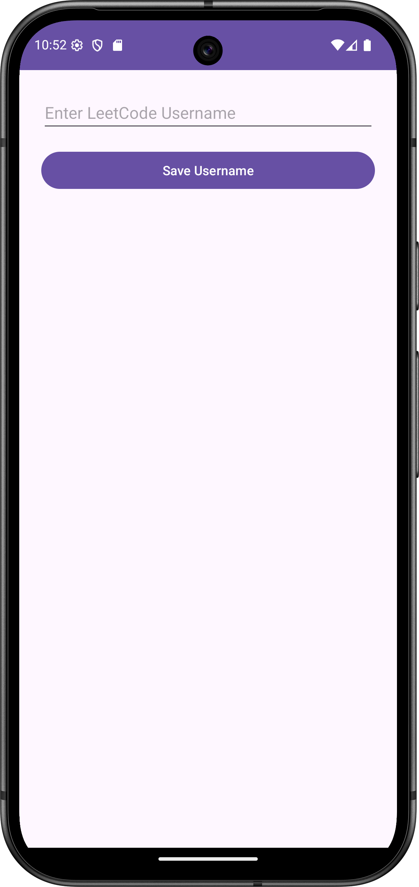
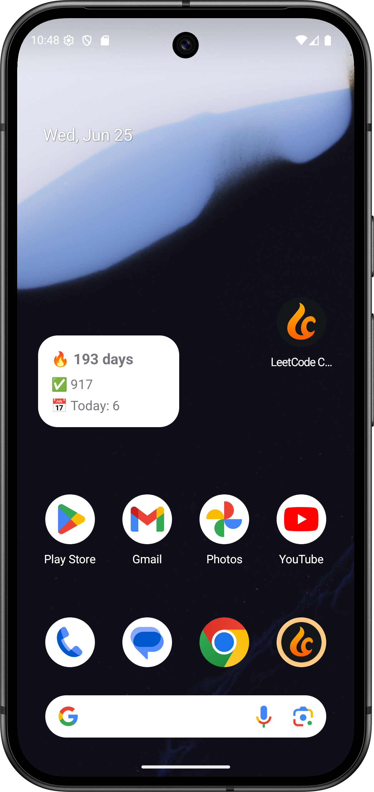

# LeetCode Connect

Track your LeetCode journey in real-time. LeetCode Connect is a lightweight Android app that displays your total problems solved, daily submissions, and streaks. With widget support and a clean interface, it helps you stay motivated and consistent on your coding path.

--------------------------------------------------------------------------------

🚀 Features

- 📊 Total Problems Solved – See your all-time LeetCode progress.
- 🔥 Daily Streak Counter – Track how many consecutive days you've solved problems.
- ✅ Today's Progress – Instantly know if you've completed at least one problem today.
- 🧩 Home Screen Widget – Stay motivated with real-time stats on your Android launcher.
- ⚙️ Username Settings – Set your LeetCode username once and fetch stats automatically.

--------------------------------------------------------------------------------

🛠️ Built With

- Kotlin – Fully native and modern Android development.
- MVVM Architecture – Clean separation of concerns using ViewModel and LiveData.
- Retrofit – For seamless HTTP API calls.
- LeetCode Stats API – Powered by https://leetcode-stats-api.herokuapp.com/
- SharedPreferences – Lightweight local persistence of user data.
- App Widgets – Android AppWidgetManager integration for home screen components.

--------------------------------------------------------------------------------

📷 Screenshots

| Main Screen         | Settings Screen     | Widget             |
|---------------------|---------------------|--------------------|
|    |     |   |

--------------------------------------------------------------------------------

🧑‍💻 Getting Started

📦 Requirements

- Android Studio (latest version recommended)
- Minimum SDK: 23 (Android 6.0)
- Internet connection for fetching stats

🔧 Setup Instructions

1. Clone this repository:

   git clone https://github.com/yourusername/leetcode-connect.git

2. Open in Android Studio:

   File → Open → Select leetcode-connect directory

3. Build the project and run it on an emulator or Android device.

4. On first launch, click "Set Username" → Enter your LeetCode username → Save.

--------------------------------------------------------------------------------

📝 To-Do / Planned Improvements

- [ ] Redesign UI for better visual hierarchy and modern appearance
- [ ] Add error animations and offline support
- [ ] Add charts for streak visualization (optional)
- [ ] Option to track multiple usernames (for competitive groups)

--------------------------------------------------------------------------------

🙌 Acknowledgements

- LeetCode Stats API by https://github.com/realdonaldtrump/leetcode-stats-api
- Android Developer Documentation
- Inspiration from Duolingo’s streak tracking design

--------------------------------------------------------------------------------

⭐ Contributing

Contributions are welcome! Please fork the repo and open a pull request for any improvements or feature suggestions.

--------------------------------------------------------------------------------
